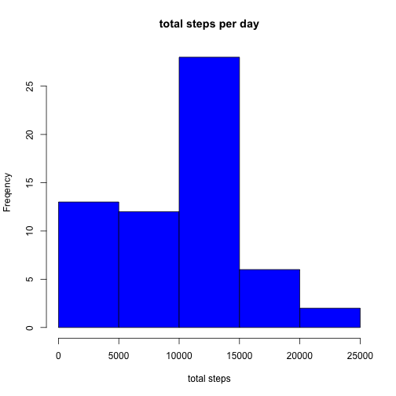
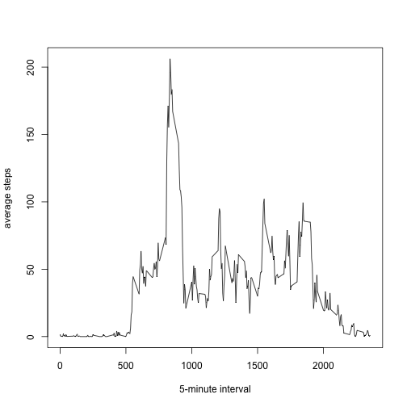
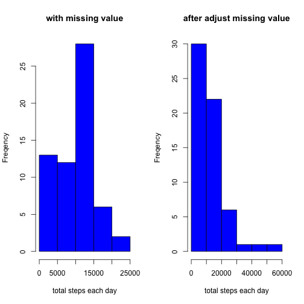
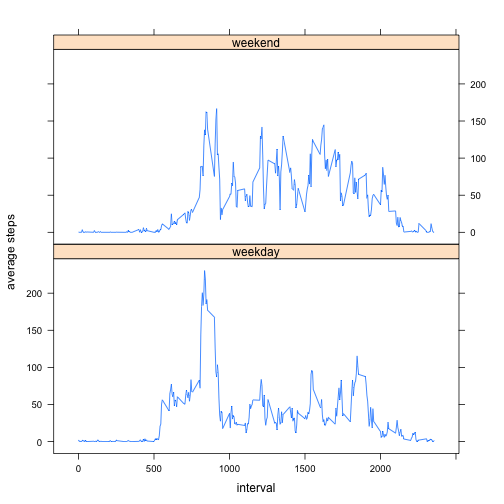

# Reproducible Research: Peer Assessment 1 
# Activity Monitoring on Personal Movement
---

    
## Loading and preprocessing the data

## 1.Load the data

```r
actv <- read.csv("../RepData_PeerAssessment1-master/activity.csv", header = T, sep = ",")
str(actv)
```

```
## 'data.frame':	17568 obs. of  3 variables:
##  $ steps   : int  NA NA NA NA NA NA NA NA NA NA ...
##  $ date    : Factor w/ 61 levels "2012-10-01","2012-10-02",..: 1 1 1 1 1 1 1 1 1 1 ...
##  $ interval: int  0 5 10 15 20 25 30 35 40 45 ...
```

## 2.Process/transform the data (if necessary) into a 
## format suitable for your analysis

```r
actv[,'date'] <- as.Date(actv[,'date'])
str(actv)
```

```
## 'data.frame':	17568 obs. of  3 variables:
##  $ steps   : int  NA NA NA NA NA NA NA NA NA NA ...
##  $ date    : Date, format: "2012-10-01" "2012-10-01" ...
##  $ interval: int  0 5 10 15 20 25 30 35 40 45 ...
```


## What is mean total number of steps taken per day?
#### For this part of the assignment, you can ignore the missing values in the dataset.

## 1.Calculate the total number of steps taken per day
## 2.Make a histogram of the total number of steps taken each day. 
#### note the difference between barplot

```r
totStep <- aggregate(actv[c("steps")], 
                         list(date = actv$date), sum ,na.rm=T)

hist(totStep$steps,xlab="total steps",ylab="Freqency",main="total steps per day",
     col="blue" )
```



## 3.Calculate and report the mean and median of the total number of steps taken per day

```r
tmp <- totStep[,2]
meanStep <- round(mean(tmp,na.rm=TRUE))
print(c("the mean of total number of steps is",meanStep))
```

```
## [1] "the mean of total number of steps is"
## [2] "9354"
```

```r
medianStep <- round(median(tmp,na.rm=TRUE))
print(c("the median of total number of steps is",medianStep))
```

```
## [1] "the median of total number of steps is"
## [2] "10395"
```

## What is the average daily activity pattern?

## 1.Make a time series plot (i.e. type = "l") of the 5-minute interval (x-axis) and 
## the average number of steps taken, averaged across all days (y-axis)

```r
avgStepInterval <- aggregate(actv[c("steps")], list(interval=actv$interval),FUN=mean,na.rm=T)
plot(avgStepInterval,xlab="5-minute interval",ylab="average steps", type="l")
```



## 2.Which 5-minute interval,on average across all the days in the dataset,contains the maximum number of steps?

```r
maxinterval <- subset(avgStepInterval, 
                      avgStepInterval$steps==max(avgStepInterval$steps, na.rm = TRUE))
maxinterval
```

```
##     interval    steps
## 104      835 206.1698
```

## Imputing missing values
#### Note that there are a number of days/intervals where there are missing values (coded as NA). 
#### The presence of missing days may introduce bias into some calculations or summaries of the data.

## 1. Calculate and report the total number of missing values in the dataset (i.e.the total number of rows withNAs)

```r
rowMiss <- sum(is.na(actv$steps))
print(c("rows with missing steps data is",rowMiss))
```

```
## [1] "rows with missing steps data is" "2304"
```

## 2. Devise a strategy for filling in all of the missing values in the dataset.
## The strategy does not need to be sophisticated.
## For example, you could use the mean/median 
## for that day, or the mean for that 5-minute interval, etc.

```r
forMiss <- aggregate(actv[c("steps")], list(interval=actv$interval), mean, na.rm=T)
colnames(forMiss)[colnames(forMiss)=="steps"] <- "meanv"

actv1 <- merge(actv,forMiss,by="interval",sort=TRUE)
colnames(actv1)[colnames(actv1)=='steps'] <- "osteps"
```


## 3. Create a new dataset that is equal to the original dataset but 
## with the missing data filled in.

```r
actv1[,"steps"] <- ifelse(is.na(actv1[,"osteps"]), actv1[,"meanv"], actv1[,"osteps"])
actv1$meanv = NULL
actv1$osteps = NULL
rowMiss <- sum(is.na(actv1$steps))
print(c("after adjustment rows of missing data",rowMiss))
```

```
## [1] "after adjustment rows of missing data"
## [2] "0"
```

## 4. Make a histogram of the total number of steps taken each day and 
## Calculate and report the mean and median total number of steps taken per day. 
## Do these values differ from the estimates from the first part of the assignment? 
## What is the impact of imputing missing data on the estimates of the total daily number of steps?

```r
totStep1 <- aggregate(actv1[c("steps")], 
                         list(date = actv$date), sum ,na.rm=T)

par(mfrow=c(1,2))
hist(totStep$steps,xlab="total steps each day",ylab="Freqency",
    main="with missing value",
     col="blue"  )

hist(totStep1$steps,xlab="total steps each day",ylab="Freqency",
     main="after adjust missing value",
     col="blue" )
```




```r
tmp <- totStep1[,2]
meanStep <- round(mean(tmp,na.rm=TRUE))
print(c("after adjustment, mean of total number of steps is",meanStep))
```

```
## [1] "after adjustment, mean of total number of steps is"
## [2] "10766"
```

```r
medianStep <- round(median(tmp,na.rm=TRUE))
print(c("after adjustment, median of total number of steps is",medianStep))
```

```
## [1] "after adjustment, median of total number of steps is"
## [2] "10352"
```

```r
print(c("the mean has increase to be close to median"))
```

```
## [1] "the mean has increase to be close to median"
```

```r
print(c("the impute method result in shift in the frequency distribution of total steps"))
```

```
## [1] "the impute method result in shift in the frequency distribution of total steps"
```

## Are there differences in activity patterns between weekdays and weekends?
#### For this part the weekdays() function may be of some help here. 
#### Use the dataset with the filled-in missing values for this part.

## 1. Create a new factor variable in the dataset with two levels – 
## “weekday” and “weekend” indicating whether a given date is 
## a weekday or weekend day.

```r
actv1[,"weekd"] <- weekdays(actv1[,"date"])
actv1[,"weekdg"] <- ifelse((actv1[,"weekd"] %in% c("Sunday","Saturday")), "weekend", "weekday")
actv1[,"weekdg"] <-factor(actv1[,"weekdg"])
```

## 2. Make a panel plot containing a time series plot (i.e. type = "l") 
## of the 5-minute interval (x-axis) and the average number of steps taken, 
## averaged across all weekday days or weekend days (y-axis). 
## See the README file in the GitHub repository to see an example of 
## what this plot should look like using simulated data.


```r
 avgStepInterval1 <- aggregate(actv1[c("steps")], 
                             list(interval = actv1$interval, daytype = actv1$weekdg),
                             FUN=mean, na.rm=T)

library(lattice)
xyplot(steps ~ interval | daytype, data=avgStepInterval1, layout=c(1,2), 
       type="l", ylab = "average steps")
```




```r
print(c("except for 1 interval, the general trend of steps for weekend and weekday is the same"))
```

```
## [1] "except for 1 interval, the general trend of steps for weekend and weekday is the same"
```
